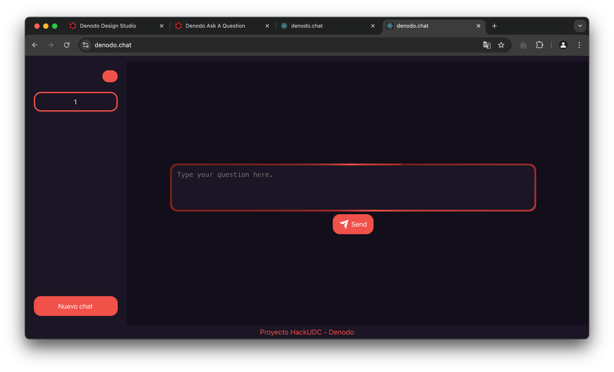

# 📘 Documentación del Frontend

## 📌 Introducción

Este proyecto es una aplicación web desarrollada con React utilizando `create-react-app`. Permite a los usuarios interactuar con un sistema de chat basado en una API backend que lanza peticiones al endpoint de ```Denodo```. La interfaz está diseñada con React, Redux para la gestión de estado y algunas bibliotecas adicionales para mejorar la experiencia de usuario (ej: La biblioteca react-markdown usanda para visualizar correctamente Markdown junto con remark-gfm para admitir características extendidas como tablas y listas de tareas.).

---

## 📋 Requisitos previos

### 📌 Requisitos del sistema

- Node.js (`>=16.x.x`)
- npm (`>=8.x.x`)
- Acceso a la API backend (`URL: http://IP_LOCAL_SERVIDOR:8888`)

### 📌 Dependencias principales

- React (`react`, `react-dom`)
- Redux (`react-redux`, `redux-toolkit`)
- React Router (`react-router-dom`)
- Axios / Fetch (para llamadas HTTP)

---

## 🚀 Instalación

```bash
# Clonar el repositorio
git clone https://github.com/tu-repositorio/frontend.git
cd frontend

# Instalar dependencias
npm install

# Ejecutar en modo desarrollo
npm start
```

Si se requiere una configuración especial (variables de entorno, archivos de configuración), debes mencionarlo.

---

## 📂 Estructura del proyecto

```
📦 HackUDC25-Denodo
 ┣ 📂 frontend               # Código fuente del frontend React
 ┃ ┣ 📂 public               # Archivos estáticos (favicon, index.html, manifest.json)
 ┃ ┣ 📂 src                  # Código fuente del frontend
 ┃ ┃ ┣ 📂 backend            # Servicios de conexión con el backend
 ┃ ┃ ┃ ┣ 📜 appFetch.js      # Función para hacer peticiones HTTP
 ┃ ┃ ┃ ┣ 📜 denodoService.js # Lógica de conexión con el backend Denodo
 ┃ ┃ ┃ ┣ 📜 index.js         # Exportación de servicios
 ┃ ┃ ┃ ┗ 📜 NetworkError.js  # Manejo de errores de red
 ┃ ┃ ┣ 📂 i18n               # Configuración de internacionalización (traducciones)
 ┃ ┃ ┣ 📂 modules           # Módulos organizados por funcionalidad
 ┃ ┃ ┃ ┣ 📂 app             # Componentes principales de la app
 ┃ ┃ ┃ ┗ 📂 common          # Componentes reutilizables
 ┃ ┃ ┣ 📂 store             # Configuración del estado global con Redux
 ┃ ┃ ┃ ┣ 📜 Global.css      # Estilos globales
 ┃ ┃ ┃ ┣ 📜 index.js        # Configuración inicial del store
 ┃ ┃ ┃ ┗ 📜 logo.svg        # Logo de la aplicación
 ┃ ┃ ┣ 📜 reportWebVitals.js # Medición de rendimiento
 ┃ ┣ 📜 .env.development     # Variables de entorno para desarrollo
 ┃ ┣ 📜 .env.production      # Variables de entorno para producción
 ┃ ┣ 📜 deploy.sh           # Script de despliegue
 ┃ ┣ 📜 Dockerfile          # Configuración para ejecutar en Docker
 ┃ ┣ 📜 package.json        # Configuración de dependencias y scripts de npm
 ┃ ┣ 📜 package-lock.json   # Archivo de bloqueo de versiones de npm
 ┃ ┗ 📜 README.md           # Documentación del proyecto
```

---

## ⚙️ Configuración

### 📌 Variables de entorno

```ini
REACT_APP_BACKEND_URL=http://localhost:8008
```

---

## 🎯 Uso de la aplicación

- **Pantalla principal:** Muestra el chat activo.
- **Menú lateral:** Permite cambiar un chat o crear uno nuevo.




---

## 🏗 Desarrollo y buenas prácticas

- Uso de componentes reutilizables y divídelos en /modules/common y /modules/app.
- Se mantiene la lógica separada de la presentación (Pattern: Presentational & Container Components).
- Se organiza el código en archivos pequeños y manejables en vez de tener archivos grandes.

### 📌 Estado global con Redux
Se utiliza `combineReducers` para gestionar diferentes partes del estado de manera modular.

### **1️⃣ Estructura del Estado Global**
El estado inicial de la aplicación está definido en `initialState` y contiene:

| Propiedad  | Tipo    | Descripción |
|------------|--------|-------------|
| `error`    | `null | string` | Almacena el mensaje de error en caso de fallo. |
| `loading`  | `boolean` | Indica si la aplicación está en estado de carga. |
| `chat`     | `number`  | Representa el ID del chat actualmente seleccionado. |
| `lastChat` | `number`  | Representa el ID del último chat disponible. |
| `menu`     | `boolean` | Indica el estado de visibilidad del menú. |

---

### **2️⃣ Reducers Implementados**
Cada propiedad del estado global se gestiona con su propio reducer:

#### **📌 `error` Reducer**
> Maneja los errores globales de la aplicación.

```javascript
const error = (state = initialState.error, action) => {
    switch (action.type) {
        case actionTypes.ERROR:
            return action.error;
        default:
            return state;
    }
};
```

#### **📌 `chat` Reducer**
> Actualiza el ID del chat activo cuando se selecciona un nuevo chat.

```javascript
const chat = (state = initialState.chat, action) => {
    switch (action.type) {
        case actionTypes.CHANGE_CHAT:
            return action.chat;
        default:
            return state;
    }
};
```

#### **📌 `lastChat` Reducer**
> Mantiene el ID del último chat disponible.

```javascript
const lastChat = (state = initialState.lastChat, action) => {
    switch (action.type) {
        case actionTypes.CHANGE_LAST_CHAT:
            return action.lastChat;
        default:
            return state;
    }
};
```

#### **📌 `menu` Reducer**
> Controla la visibilidad del menú lateral.

```javascript
const menu = (state = initialState.menu, action) => {
    switch (action.type) {
        case actionTypes.MENU:
            return action.menu;
        default:
            return state;
    }
};
```

#### **📌 `loading` Reducer**
> Gestiona el estado de carga de la aplicación.

```javascript
const loading = (state = initialState.loading, action) => {
    switch (action.type) {
        case actionTypes.LOADING:
            return true;
        case actionTypes.LOADED:
        case actionTypes.ERROR:
            return false;
        default:
            return state;
    }
};
```

---

### **3️⃣ Combinación de Reducers con `combineReducers`**
Para organizar mejor el estado global, se combinan todos los reducers en un único reducer principal:

```javascript
import { combineReducers } from 'redux';

const reducer = combineReducers({
    error,
    loading,
    chat,
    lastChat,
    menu
});

export default reducer;
```

Esta implementación permite gestionar cada parte del estado de forma independiente y modular.

---

### **4️⃣ Acciones Definidas en `actionTypes`**
Las acciones que modifican el estado global están definidas en `actionTypes.js`:

```javascript
export const ERROR = "ERROR";
export const LOADING = "LOADING";
export const LOADED = "LOADED";
export const CHANGE_CHAT = "CHANGE_CHAT";
export const CHANGE_LAST_CHAT = "CHANGE_LAST_CHAT";
export const MENU = "MENU";
```

---

### **5️⃣ Uso de Redux en Componentes**
#### **📌 Obtención de datos del estado global**
Para acceder al estado global en un componente, se usa `useSelector`:

```javascript
import { useSelector } from "react-redux";
const chatId = useSelector(state => state.chat);
const isLoading = useSelector(state => state.loading);
```

#### **📌 Modificación del estado con `useDispatch`**
Para cambiar el estado, se usa `useDispatch`:

```javascript
import { useDispatch } from "react-redux";
import * as actions from "../../app/actions";

const dispatch = useDispatch();
dispatch({ type: actions.CHANGE_CHAT, chat: 2 });
```


---

## 🌐 Conexión con el Backend
### **1️⃣ Envío de Preguntas al Backend (`/send`)**
Se envían mensajes al backend utilizando una petición `POST`. Se proporciona el `chatId` y la `question` en el cuerpo de la solicitud. El backend procesa la petición y devuelve la respuesta asociada.

```javascript
export const answerQuestion = async (chatId, question) => {
    try {
        const response = await fetch(`http://localhost/send`, {
            method: "POST",
            headers: {
                "Content-Type": "application/json"
            },
            body: JSON.stringify({
                chat_id: chatId,
                message: question
            })
        });

        if (!response.ok) {
            throw new Error(`Error HTTP: ${response.status}`);
        }

        const jsonResponse = await response.json();
        return jsonResponse.respuesta;
    } catch (error) {
        throw error;
    }
};
```

✔ **Método:** `POST`  
✔ **Endpoint:** `/send`  
✔ **Parámetros:** `chat_id` (ID del chat), `message` (pregunta del usuario)  
✔ **Respuesta esperada:** `{ respuesta: "Texto de respuesta" }`

---

### **2️⃣ Obtención del Historial de un Chat (`/history/{chatId}`)**
Se recupera el historial de mensajes de un chat específico mediante una petición `GET`. Se pasa el `chatId` en la URL y el backend devuelve una lista de mensajes asociados a ese chat.

```javascript
export const getChatHistory = async (chatId) => {
    try {
        const response = await fetch(`http://localhost/history/${chatId}`, {
            method: "GET",
            headers: {
                "Accept": "application/json"
            }
        });

        if (!response.ok) {
            const errorText = await response.text(); // Captura el mensaje de error si lo hay
            throw new Error(`Error HTTP ${response.status}: ${errorText}`);
        }

        const jsonResponse = await response.json();
        return jsonResponse.mensajes;
    } catch (error) {
        console.error("Error en la petición:", error);
        throw error;
    }
};
```
✔ **Método:** `GET`  
✔ **Endpoint:** `/history/{chatId}`  
✔ **Parámetros:** `chatId` (ID del chat del cual se quiere recuperar el historial)  
✔ **Respuesta esperada:** `{ mensajes: [ {msg_id, pregunta, respuesta, timestamp}, ... ] }`

---

### **3️⃣ Obtención de IDs de Chats Disponibles (`/chats`)**
Se obtiene la lista de chats existentes a través de una petición `GET`. El backend devuelve una lista con los identificadores de los chats registrados en la base de datos.

```javascript
export const getChatIds = async () => {
    try {
        const response = await fetch(`http://localhost/chats`, {
            method: "GET",
            headers: {
                "Accept": "application/json"
            }
        });

        if (!response.ok) {
            const errorText = await response.text();
            throw new Error(`Error HTTP ${response.status}: ${errorText}`);
        }

        const jsonResponse = await response.json();
        return jsonResponse.chats;
    } catch (error) {
        console.error("Error en la petición:", error);
        throw error;
    }
};
```
✔ **Método:** `GET`  
✔ **Endpoint:** `/chats`  
✔ **Parámetros:** Ninguno  
✔ **Respuesta esperada:** `{ chats: [ "chatId1", "chatId2", ... ] }`

---

### **📌 Manejo de Errores**
- Se captura cualquier error en la petición utilizando `try-catch`.
- Si la respuesta no es `ok`, se lanza un error con el código HTTP correspondiente.
- Se registran los errores en la consola (`console.error`).
- En caso de error en el backend, se captura el mensaje de error de la respuesta y se muestra.

---


---

## 📜 Licencia

N/A

---

## 📧 Contacto

✉️ [*retodenodo@hackudc.com*](mailto\:email@ejemplo.com)
